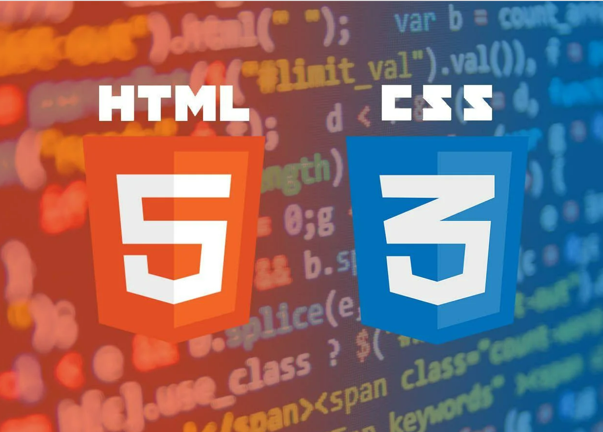

# HTML e CSS: Guia de Estudos Completo

 Este repositório foi criado com o objetivo de fornecer um guia completo para o aprendizado de HTML e CSS, desde os conceitos básicos até técnicas mais avançadas.

---
### HTML
* Introdução à estruturas do HTML  
* Principais tags e atributos  
* Criação de Formulários e tabelas

---

### CSS
* Seletores e propriedades básicas  
* Box model e posicionamento  
* Layouts com Flexbox e Grid  
* Transições e animações  
* Estilização de formulários e tabelas  
* Responsividade com media queries  
* Técnicas de otimização de CSS  
* Pré-processadores CSS (Sass, less)

---
### Projetos Práticos
* Diversos projetos para aplicar os conhecimentos adquiridos  
* Exemplos de sites responsivos e interativos

